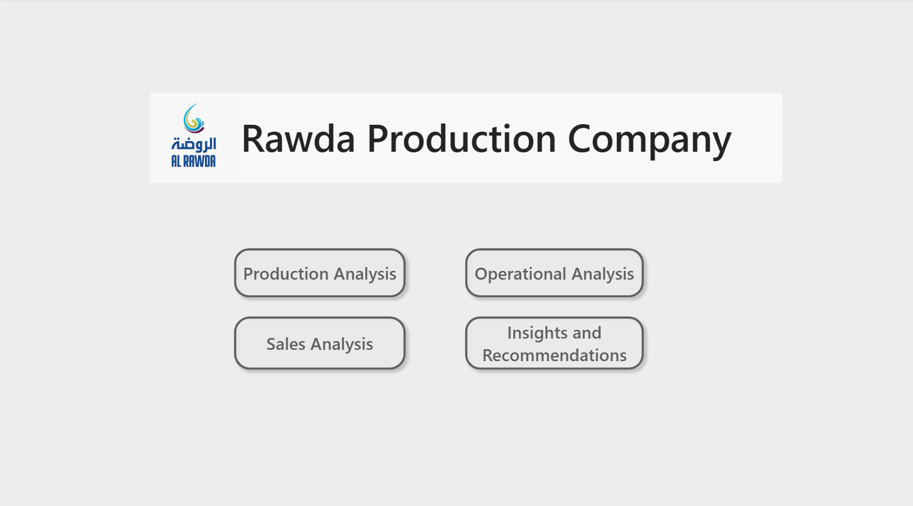
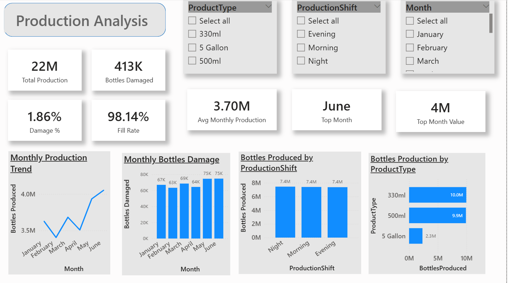
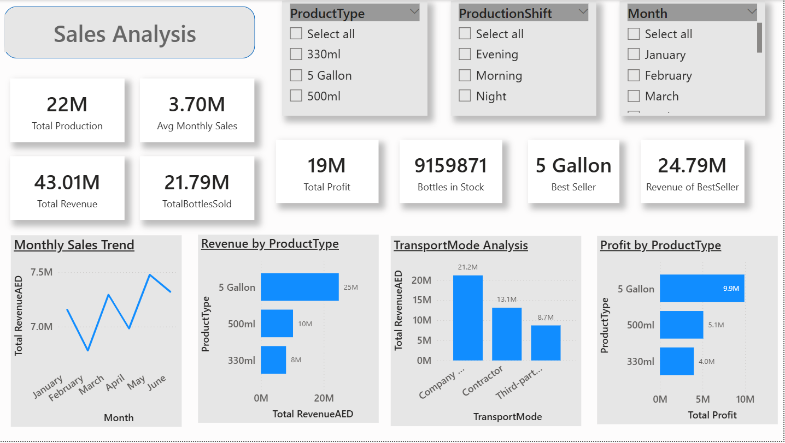
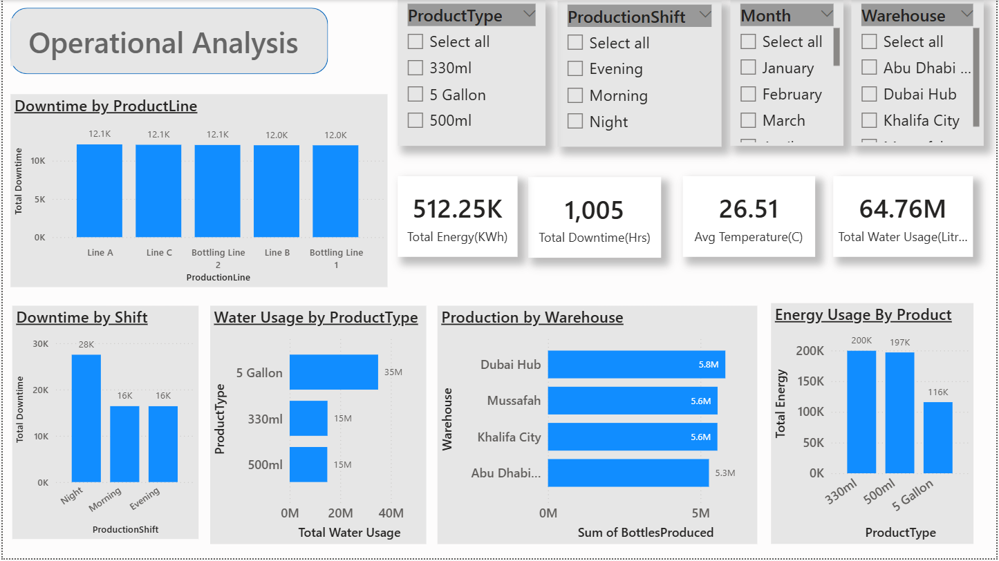
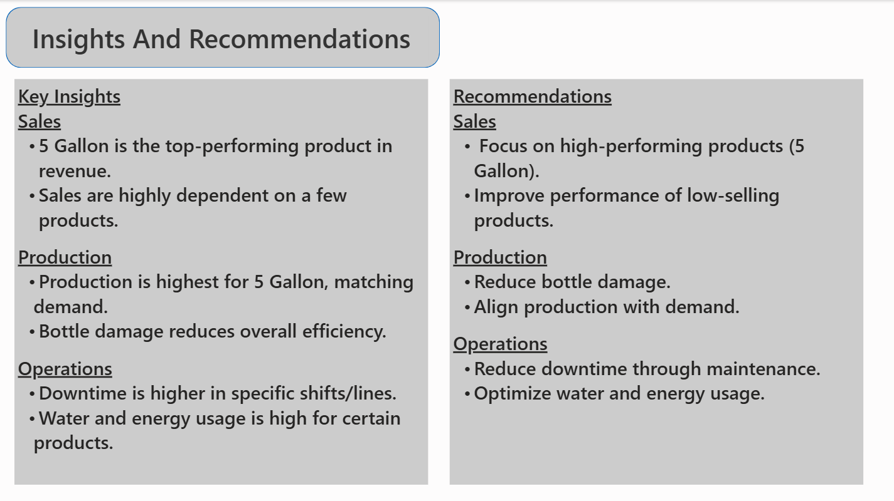

# Rawda Production Dashboard (Power BI)

## 📊 Overview
This project is a Power BI dashboard created to analyze production, sales, and operational performance of Rawda Production Company.

---

## 🔍 Key Features
- Production performance analysis
- Sales trends and revenue insights
- Operational efficiency tracking
- KPI monitoring
- Interactive dashboard with filters

---

## 🛠 Tools Used
- Power BI
- Excel
- DAX

---

## 📷 Dashboard Preview

### 🏠 Main Dashboard

### 🏭 Production Analysis

### 💰 Sales Analysis

### ⚙️ Operational Analysis

### 📌 Insights & Recommendations

---

## 📁 Files
- rawda_production_dashboard.pbix – Power BI file
