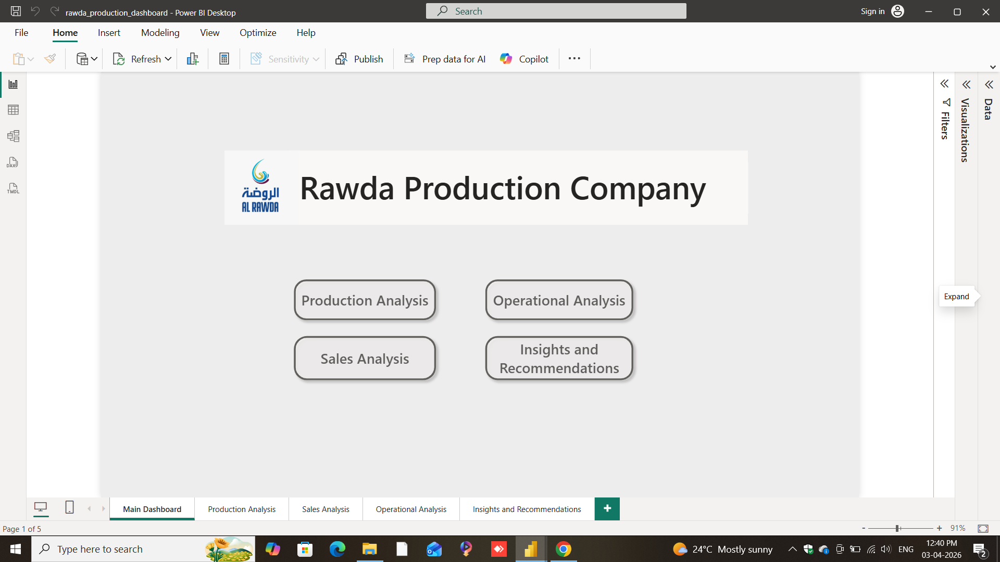
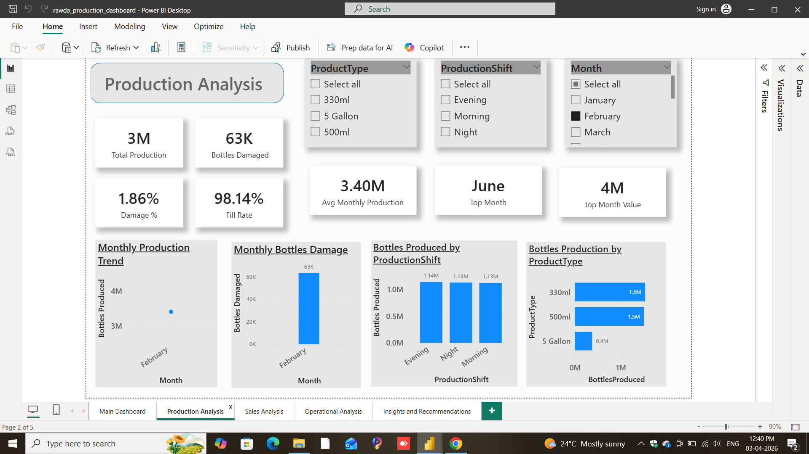
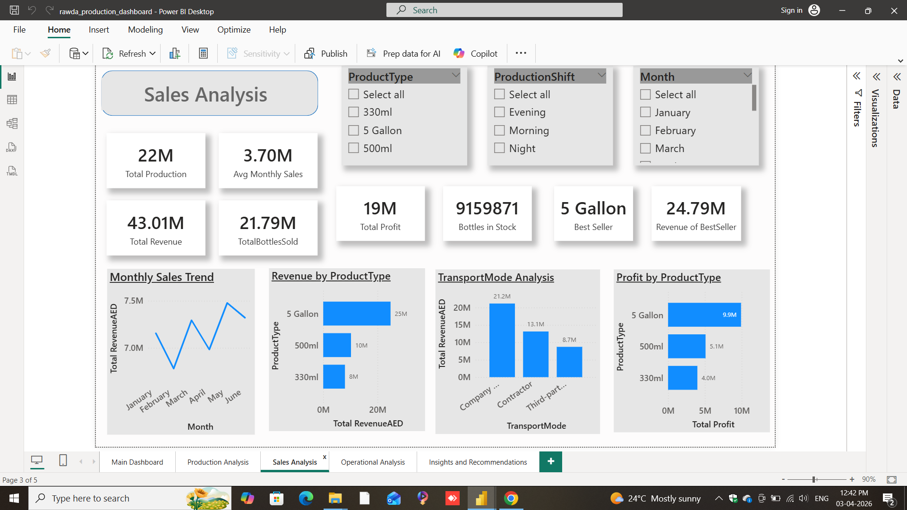
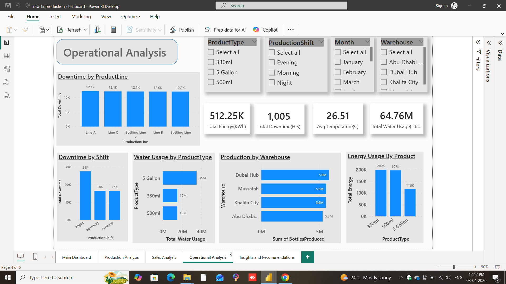
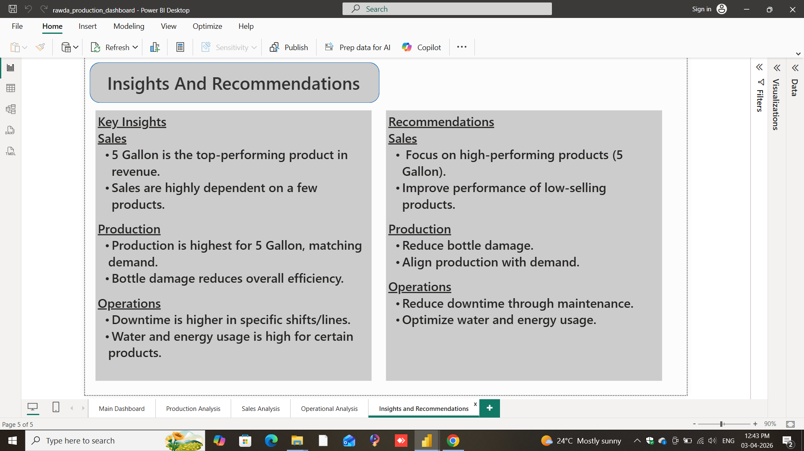

# Rawda Production Dashboard (Power BI)

## 📊 Overview
This project is a Power BI dashboard developed to analyze production data and monitor operational performance. It provides clear insights into production trends, sales performance, and operational efficiency.

## 🔍 Key Features
- Production performance tracking
- Sales and operational analysis
- KPI monitoring and trend visualization
- Interactive dashboard with filters
- Insights and recommendations for decision making

## 🛠 Tools Used
- Power BI
- Excel
- DAX

## 📷 Dashboard Preview

### 🔹 Main Dashboard

### 🔹 Production Analysis

### 🔹 Sales Analysis

### 🔹 Operational Analysis

### 🔹 Insights & Recommendations

## 📁 Files
- 'rawda_production_dashboard.pbix' – Power BI dashboard file
